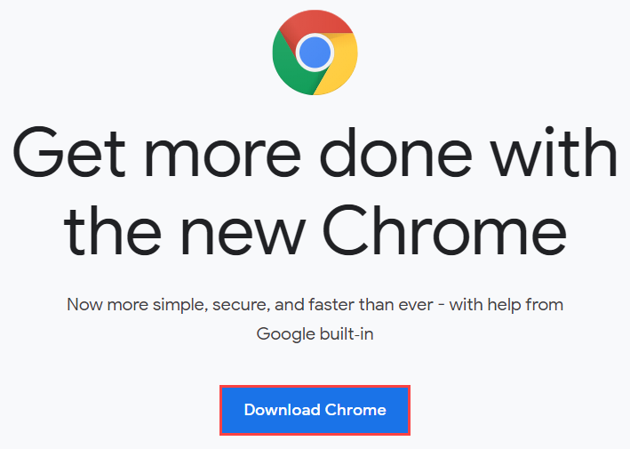
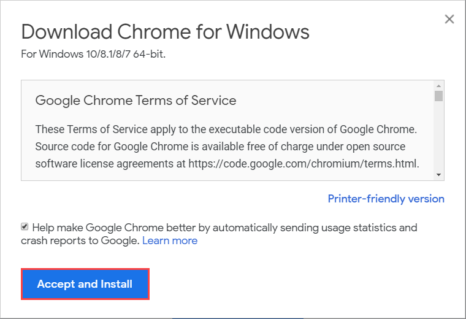
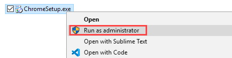
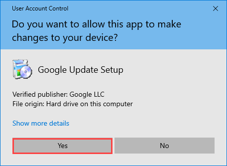
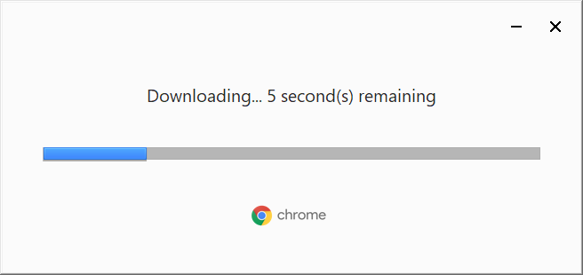
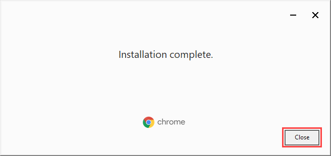

# Install Google Chrome

[Back to the main page](https://github.com/drsanti/shared)

1. Go to the [download page](https://www.google.com/chrome/), and click the `Download Chrome` button.

2. Click the `Accept and Install` button.

3. Right-click on the installer `ChromeSetup.exe` and choose the `Run as administrator`.

4. If the `User Account Control` window popups, click the `Yes` button.

5. Wait until the downloading is completed.

6. Click the `Close` button.

---

[Back to the main page](https://github.com/drsanti/shared)
