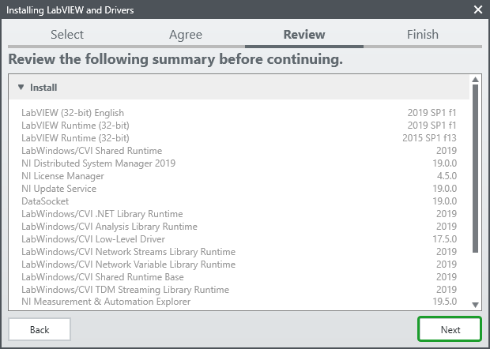

# NI Registration

> If you already have a `NI Account` go to the `Login` section below.

1. Go to `https://www.ni.com/`.

2. Click the `MY ACCOUNT` button.

3. Click `create a new user account` link.

4. Fill the registration from andclick `CREATE ACCOUNT`.

5. The `Confirm Your Account` is shown.

6. Open the email and click the link.

7. The `Thanks!` is shown, click `CONTINUE` button.

---

# Login to the NI

> If you already logged in, go to the `Download` section below.

1. Go to `https://www.ni.com/`.

2. Click the `MY ACCOUNT` button.

3. Click `login` link.

4. Enter `Email` and `Password` in the `Log In` form, then click the `LOG IN` button.

5. The `MyNI` page will be displayed.

---

# Download LabVIEW 2019

1. Go to `https://www.ni.com/`.

2. Log in with the `NI Account`

3. Click the `PRODUCTS` tab.

4. Click the `LabVIEW` link.

5. Click the `START FREE TRIAL` and select `LabVIEW 2019`.

6. Choose the desired version as shown in the picture below (**must be 32-bit**), and click the `DOWNLOAD` button.

7. Fill the needed infomation and click the `CONTINUE` button.

8. The `Next Step` page will be shown and the downloading is started.

---

# Install LabVIEW 2019 on Windows

1. Right-click on the installer, `ni-labview-2019-x86_19.1_suite_online_repack.exe`, and choose `Run as administrator`. If the `User Account Control` popups, click `Yes` button.

2. Select the `I accept the above license agreement.` and click the `Next` button.

3. Check the `Disable Windows fast startup` and click the `Next` button.

4. Click the `Next` button.

5. Wait untill the downloading is completed.

6. The `NI Package Manager` will start.

7. Select the `LabVIEW` (other items can be deselected) and click the `Next` button.

8. Select the desired packages and click the `Next` button. (In this case, no additional packages are required)

9. Select the `I accept the above license agreement.` and click the `Next` button.

10. Select the `I accept the above 2 license agreements.` and click the `Next` button.

11. Click the `Next` button.

12. Wait until the installing process is completed.

13. Click `No` if the update service is not required.

14. Click `No` if don't want to participate.

15. Click the `LOG IN TO ACTIVATE` button.

16. Enter the `Email` and `Password` in the login form and click the `LOG IN` button.

17. Click the `EXTEND TRIAL (2)` button.

18. Click the `FINISH` button. Now, we get 45 days to work with the LabVIEW.

19. Click the `Reboot` button, and enjoy with the LabVIEW 2019.

---
