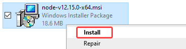
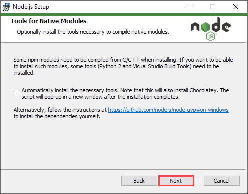
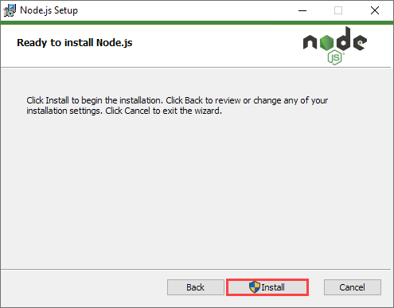
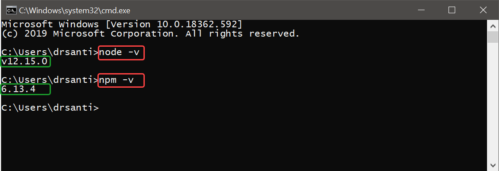

# Install Node.js

[Back to the main page](https://github.com/drsanti/shared)

1. Download Node.js installer, [`node-v12.15.0-x64.msi`](https://nodejs.org/dist/v12.15.0/node-v12.15.0-x64.msi), by clicking [here](https://nodejs.org/dist/v12.15.0/node-v12.15.0-x64.msi).

>:information_source: The `node-v12.15.0-x64.msi` is recommended for the workshops.

>:warning: If aother version of the Node.js was installed, please **uninstall** it first.

2. Right-click on the installer `node-v12.15.0-x64.msi`, and choose the `install`.

3. Click the `Next` button.

4. Select the `I accept the terms in the License Agreement` and click the `Next` button.

5. Choose the destination folder and then click the `Next` button.

6. Click the `Next` button.

7. Click the `Next` button.

8. Click the `Install` button.

9. If the `User Account Control` window popups, click the `Yes` button.

10. Wait until the installation is completed.

11. Click the `Finish` button.

12. Check if the `node.js` and `npm` are successfully installed by opening the `Command Prompt` and enter the commands `node -v` and `npm -v`.

>:information_source: The version of the `node` and the `npm` should be `v12.15.0` and `6.13.4` for the workshops.

---

[Back to the main page](https://github.com/drsanti/shared)
