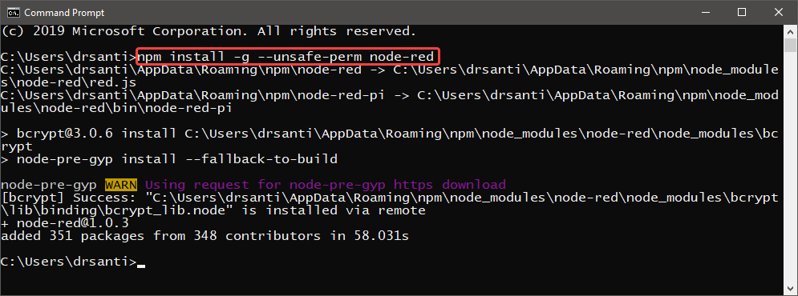
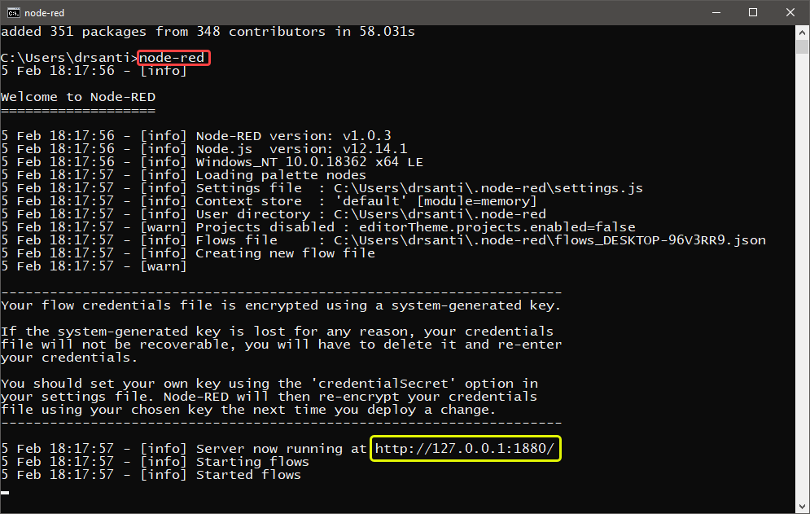
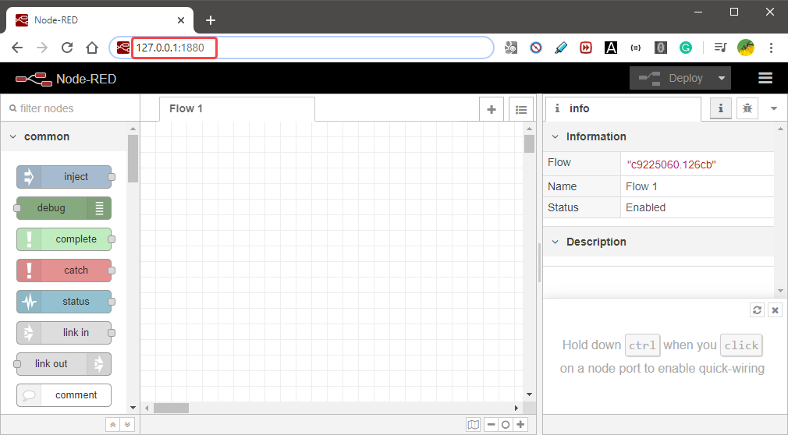

# Install Node-RED

> If Node.js is not installed, please install it before move to the steps below. Click [here](https://github.com/drsanti/shared/blob/master/2020/docs/nodejs/install/README.md) for the Nide.js installation.

1. Open a `Command Prompt` and enter the command:

```text
npm install -g --unsafe-perm node-red
```

and wait untill the installation is completed.



2. To run the `Node-Red`, enter the floowing command in the `Command Prompt`

```text
node-red
```




3. Open a `web browser` and enther the following url in the url bar

```text
127.0.0.1:1880
```




4. To stop the `Nore-RED`, back to the  `Command Prompt` and press `CTRL+C`.

---
