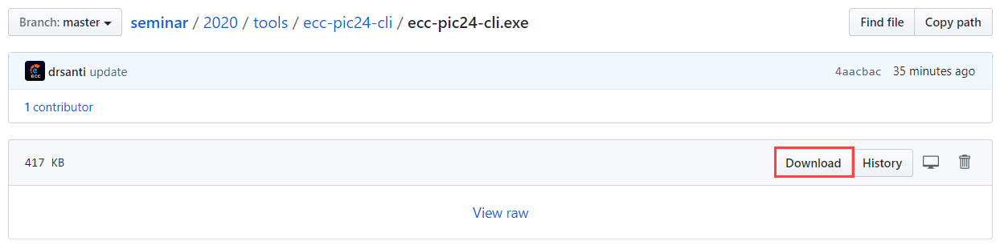
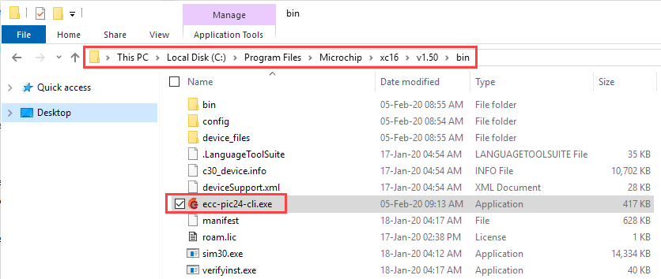
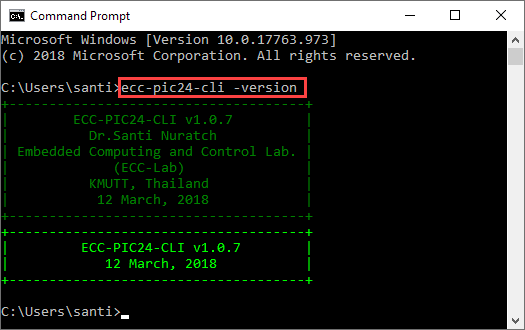
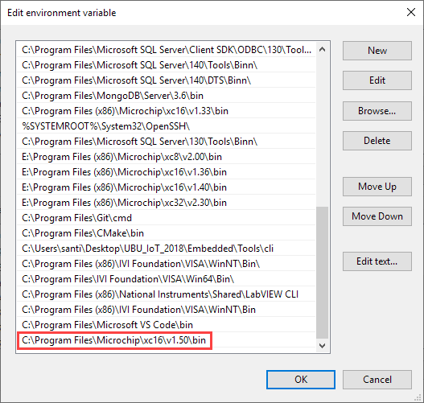

# Install ecc-pic24-cli

[Back to the main page](https://github.com/drsanti/shared)

> If the XC16 Compiler is not installed, please install it first. Check [here](../../xc16/install) for the installation steps.

1. Go to [this page](https://github.com/drsanti/seminar/blob/master/2020/tools/ecc-pic24-cli/ecc-pic24-cli.exe) and click the `Download` button.



2. Copy the downloaded file, the `ecc-pic24-cli.exe` and paste in the `bin` directory of the `xc16`.



3. Open a `Command Prompt` (if it is now opening, close and open) and enter `ecc-pic24-cli -version`. It will show the version information as shown in the picture.



---

> If the version information is not shown, check the following:

- Is the command corrected?

```text
ecc-pic24-cli -version
```

- Is the corrected `bin` path of the `xc16` added to the `PATH` of `Environment Variables`?



---

[Back to the main page](https://github.com/drsanti/shared)
