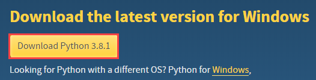
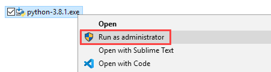
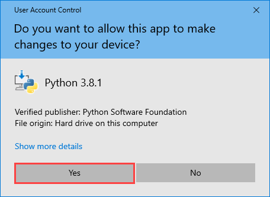
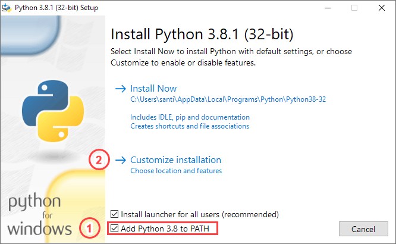
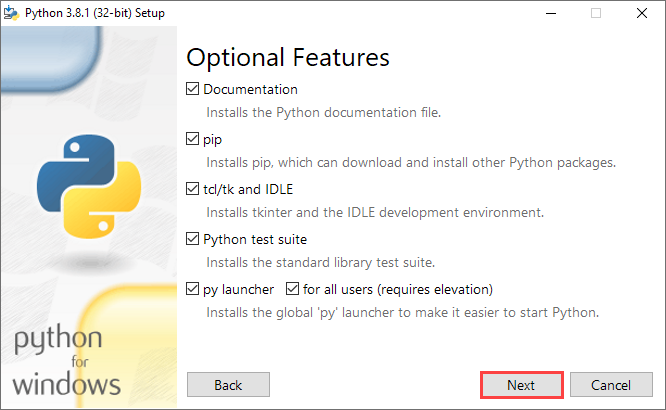
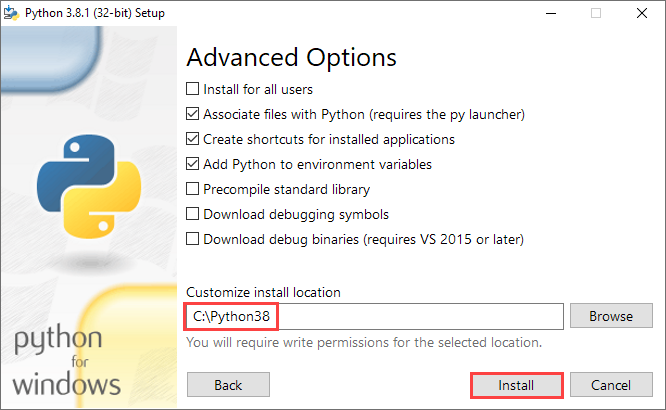
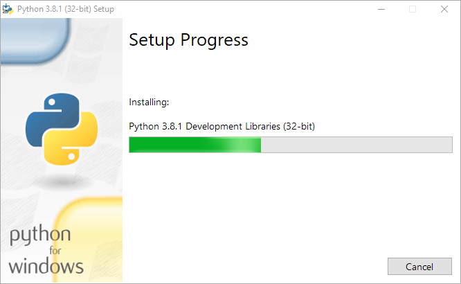
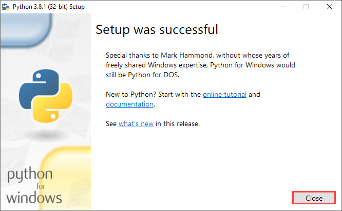
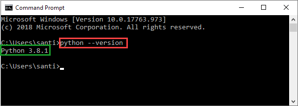

# Install Python 3.8

[Back to the main page](https://github.com/drsanti/shared)

1. Go to the [download page](https://www.python.org/downloads/) and click the `Download Python 3.8.1` button.

2. After the download is completed, Right-click on the installer `python-3.8.1.exe` and choose the `Run as administrator`.

3. If the `User Account Control` window popups, click the `Yes` button.

4. Select the `Add Python 3.8 to PATH` and then click the `Customize installation`.

5. Select all and click the `Next` button.

6. Change the install location to `C:\Python32` (or aother), then click the `Install` button.

7. Wait until the installation is completed.

8. Click the `Close` button.

9. Open a new `Command Prompt` and enter a command `python --version`. It should show `Python 3.8.1` (or another version you installed).

---

[Back to the main page](https://github.com/drsanti/shared)
