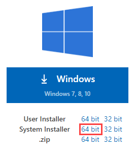
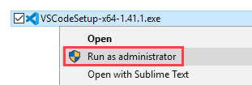
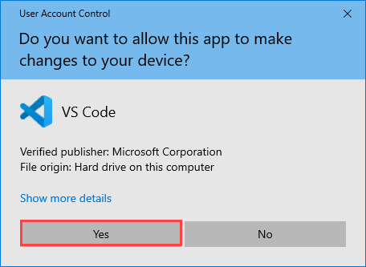
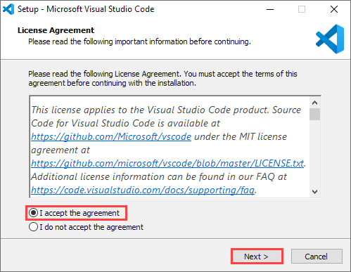
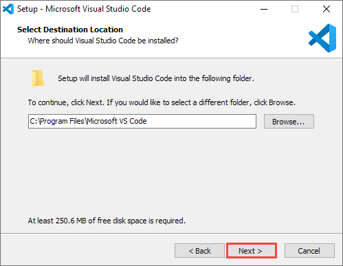
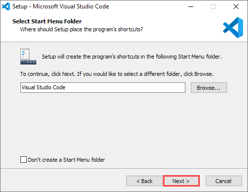
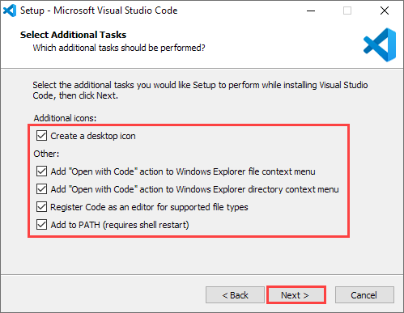
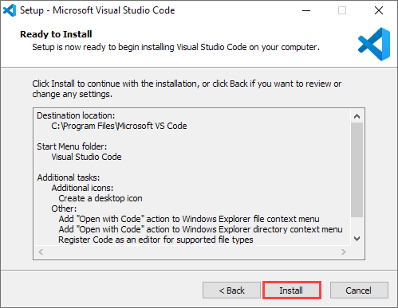
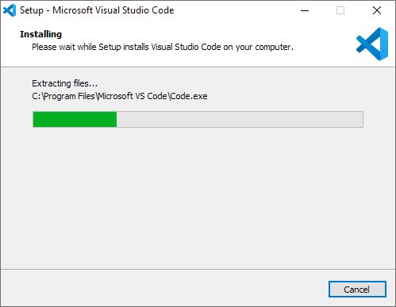
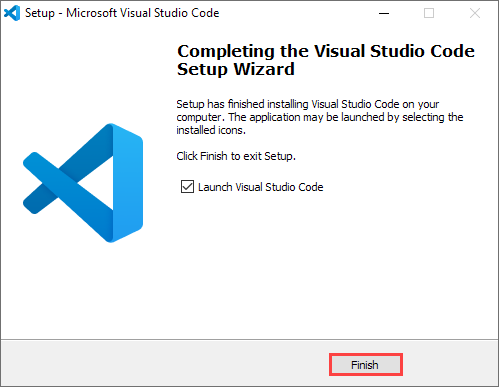

# Install VSCode

1. Go to `https://code.visualstudio.com/download` and click the `64-bit` of `System Installer`.

2. Right-click on the  installer `VSCodeSetup-x64-1.4.1.exe` (or newer version) and choose the `Run as administrator`.

3. If the `Use Account Control` window popups, click `Yes` button.

4. Select the `I accept the agreement` and then click the  `Next` button.

5. Choose the destination location (default in this case), and click the  `Next` button.

6. Select the start menu folder (default in this case), and click the  `Next` button.

7. **Select all** addition tasks (options), and click the `Next` button.

8. Click the `Next` button.

9. Wait untill the installation is completed.

10. Click the `Finish` button.

---
