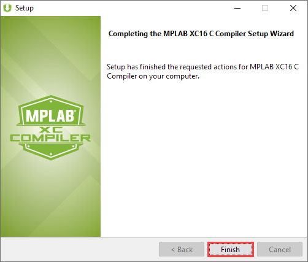

# Install XC16 Compiler

[Back to the main page](https://github.com/drsanti/shared/README.md)

1. Go to `https://www.microchip.com/mplab/compilers`, move down to the bottom of the page, and click the `Compiler Downloads` tab.

2. Click the link `MPLAB XC16 Compiler v1.50` to download.

3. After the installer is downloaded, Right-click on the installer `xc16-v1.50-full-install-windows64-installer.exe` and choose `Run as administrator`.

4. If the `User Account Control` window popups, click the `Yes` button.

5. Click the `Next` button.

6. Choose the `I accept the agreement` and click the `Next` button.

7. Choose `Free` and click the `Next` button.

8. Click the `Next` button.

9. **Select** the `Add xc16 to the PATH environment variable`.

10. Click the `Next` button.

11. Wait until the installation is completed.

12. Click the `Next` button.

13. Click the `Finish` button.

---

[Back to the main page](https://github.com/drsanti/shared/README.md)
